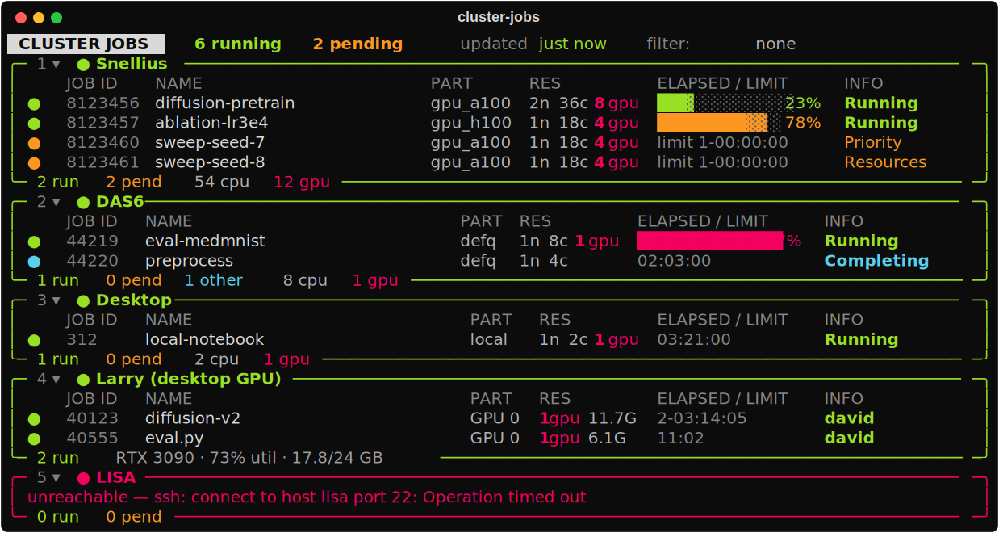

# cluster-job-monitor

A **read-only terminal dashboard** that shows your SLURM jobs across several
clusters **and** your desktop in one view. It SSHes into each host, runs
`squeue --me`, and renders a live, colour-coded overview.

[Get started in the Quick start :material-arrow-right:](quickstart.md){ .md-button .md-button--primary }

## Read-only by design

The only commands ever run are `squeue` and `sinfo` (SLURM hosts) and
`nvidia-smi` + `ps` (non-SLURM GPU hosts). There is **no code path** that can
cancel or submit jobs. It uses *your* existing SSH config and keys — nothing new
is exposed, no server, no stored secrets.

## Features

- **One view across hosts** — every cluster, plus your local desktop, in a
  single live TUI.
- **For coding agents** — a one-shot [`--overview`](agent-overview.md) (CLI
  **or** [MCP](mcp.md)) returns, per cluster *and* partition, how many CPUs/GPUs
  are free — broken down by GPU type, with the largest free block on a single
  node — plus your queued/running jobs and an approximate queueing time.
- **Non-SLURM GPU boxes** — point it at a workstation with
  [`"scheduler": "gpu"`](configuration.md#non-slurm-gpu-hosts) and it shows one
  row per GPU process via `nvidia-smi`.
- **No-cluster demo** — try the whole thing with synthetic data using `--demo`.
- **Keyboard-driven** — collapse/expand clusters, filter by state, cluster,
  partition, or job name.

## Where to next

- **[Quick start](quickstart.md)** — install and run the demo in under a minute.
- **[Configuration](configuration.md)** — point it at your real clusters.
- **[Agent overview](agent-overview.md)** — the capacity JSON for agents.
- **[MCP](mcp.md)** — expose the overview to Claude Code / Cursor.
- **[Development](development.md)** — tests, coverage, CI.
